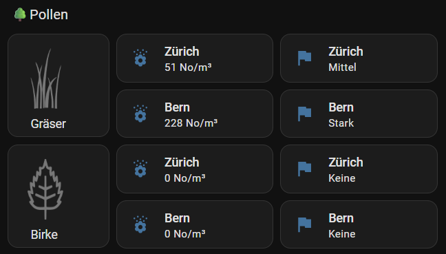
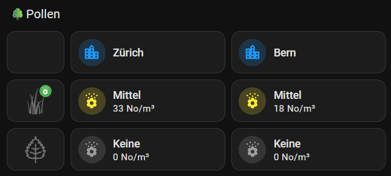

# Swiss Pollen integration for Home Assistant

[![hacs_badge][hacs-shield]][hacs]
![Project Maintenance][maintenance-shield]
[![License][license-shield]][license]

![Downloads][downloads-shield]
![Downloads][downloads-latest-shield]


[![Build Status][build-status-shield]][build-status]
[![Deploy Status][deploy-status-shield]][deploy-status]

A Home Assistant integration that provides pollen data for Switzerland from [MeteoSchweiz][MeteoSchweiz].
Data integration is done via [swiss-pollen][swiss-pollen].

This integration is not officially developed, supported or endorsed by MeteoSchweiz.

## Features

- Provides pollen concentration data for various plant types in Switzerland
- Data is sourced from [MeteoSchweiz][MeteoSchweiz]
- Supports multiple measurement stations across Switzerland
- Provides both numeric values (No/m³) and categorical levels (None, Low, Medium, Strong, Very Strong)

## Installation

### HACS (recommended)

You can install this component through [HACS](https://hacs.xyz/) to easily receive updates. Once HACS is installed, click this link:
[](https://my.home-assistant.io/redirect/hacs_repository/?owner=frimtec&repository=hass-swiss-pollen)

### Manual Installation

1. Download the latest release from the [releases page](https://github.com/frimtec/hass-swiss-pollen/releases)
2. Unpack the release and copy the `custom_components/swiss_pollen` directory into your Home Assistant's `custom_components` directory
3. Restart Home Assistant

## Configuration

1. Go to Settings > Devices & Services
2. Click "Add Integration"
3. Search for "Swiss Pollen"
4. Follow the configuration flow to set up a service for a specific plant:
   - Select a plant of interest
   - Select one or more measurement stations to get sensors for these stations
5. You can repeat step 4) to set up multiple services, one for each plant you are interested in

## Available Sensors

For each selected station and plant type combination, the integration creates two sensors:

1. **Numeric concentration (Sensor)**: Shows the pollen concentration in No/m³ (number per cubic meter)
   - Icon: mdi:flower-pollen

2. **Level (Sensor)**: Shows the categorical level of pollen concentration
   - Possible values: None, Low, Medium, Strong, Very Strong
   - Icon: mdi:flag
3. **Plant season (BinarySensor)**: Shows whether the plant has pollen season or not. The sensor is 'on' if at least one station in Switzerland reports a value greater than zero).
4. **Backend version (Diagnostic sensor)**: Shows the version of the backend providing the pollen data.

## Example Dashboard
### Standard UI

<details>

<summary>YAML-Code</summary>

```
- type: grid
  cards:
    - type: heading
      heading: 🌳Pollen
      heading_style: title
    - type: markdown
      content: >-
        

        &nbsp;&nbsp;&nbsp;Gräser
      grid_options:
        columns: 3
        rows: 2
    - type: horizontal-stack
      cards:
        - type: tile
          name: Zürich
          entity: sensor.grasses_zurich
          features_position: bottom
          vertical: false
          hide_state: false
        - type: tile
          name: Zürich
          entity: sensor.grasses_zurich_2
          features_position: bottom
          vertical: false
      grid_options:
        columns: 9
        rows: auto
    - type: horizontal-stack
      cards:
        - type: tile
          name: Bern
          entity: sensor.grasses_bern
          features_position: bottom
          vertical: false
        - type: tile
          name: Bern
          entity: sensor.grasses_bern_2
          features_position: bottom
          vertical: false
      grid_options:
        columns: 9
        rows: auto
    - type: markdown
      content: >-
        

        &nbsp;&nbsp;&nbsp;Birke
      grid_options:
        columns: 3
        rows: 2
    - type: horizontal-stack
      cards:
        - type: tile
          name: Zürich
          entity: sensor.birch_zurich
          features_position: bottom
          vertical: false
        - type: tile
          name: Zürich
          entity: sensor.birch_zurich_2
          features_position: bottom
          vertical: false
      grid_options:
        columns: 9
        rows: auto
    - type: horizontal-stack
      cards:
        - type: tile
          name: Bern
          entity: sensor.birch_bern
          features_position: bottom
          vertical: false
        - type: tile
          name: Bern
          entity: sensor.birch_bern_2
          features_position: bottom
          vertical: false
      grid_options:
        columns: 9
        rows: auto
```
</details>

### Mushroom
Requires HACS component [lovelace-mushroom][lovelace-mushroom].



<details>

<summary>YAML-Code</summary>

```
- type: grid
  cards:
    - type: heading
      heading: 🌳Pollen
      heading_style: title
    - type: custom:mushroom-template-card
      grid_options:
        columns: 2
        rows: 1
      tap_action:
        action: none
      layout: vertical
    - type: custom:mushroom-template-card
      icon: mdi:city
      primary: Zürich
      grid_options:
        columns: 5
        rows: 1
      icon_color: blue
    - type: custom:mushroom-template-card
      icon: mdi:city
      primary: Bern
      grid_options:
        columns: 5
        rows: 1
      icon_color: blue
    - type: custom:mushroom-template-card
      grid_options:
        columns: 2
        rows: 1
      tap_action:
        action: none
      layout: vertical
      picture: >-
        https://github.com/frimtec/hass-swiss-pollen/blob/main/images/grass.png?raw=true
      badge_icon: >-
        
        
        mdi:flower-pollen  
        
      badge_color: >-
        
        
        green 
        
    - type: custom:mushroom-template-card
      icon: mdi:flower-pollen
      entity: sensor.grasses_zurich
      primary: '{{ state_translated(''sensor.grasses_zurich_2'') }}'
      secondary: '{{ states(''sensor.grasses_zurich'') }} No/m³'
      grid_options:
        columns: 5
        rows: 1
      tap_action:
        action: more-info
      icon_color: |-
        
        
          grey  
        
          blue
        
          yellow
        
          orange
        
          red
        
    - type: custom:mushroom-template-card
      icon: mdi:flower-pollen
      entity: sensor.grasses_bern
      primary: '{{ state_translated(''sensor.grasses_bern_2'') }}'
      secondary: '{{ states(''sensor.grasses_bern'') }} No/m³'
      grid_options:
        columns: 5
        rows: 1
      tap_action:
        action: more-info
      icon_color: |-
        
        
          grey  
        
          blue
        
          yellow
        
          orange
        
          red
        
    - type: custom:mushroom-template-card
      grid_options:
        columns: 2
        rows: 1
      tap_action:
        action: none
      layout: vertical
      picture: >-
        https://github.com/frimtec/hass-swiss-pollen/blob/main/images/birch.png?raw=true
      badge_icon: >-
        
        
        mdi:flower-pollen  
        
      badge_color: >-
        
        
        green
        
    - type: custom:mushroom-template-card
      icon: mdi:flower-pollen
      entity: sensor.birch_zurich
      primary: '{{ state_translated(''sensor.birch_zurich_2'') }}'
      secondary: '{{ states(''sensor.birch_zurich'') }} No/m³'
      grid_options:
        columns: 5
        rows: 1
      tap_action:
        action: more-info
      icon_color: |-
        
        
          grey  
        
          blue
        
          yellow
        
          orange
        
          red
        
    - type: custom:mushroom-template-card
      icon: mdi:flower-pollen
      entity: sensor.birch_bern
      primary: '{{ state_translated(''sensor.birch_bern_2'') }}'
      secondary: '{{ states(''sensor.birch_bern'') }} No/m³'
      grid_options:
        columns: 5
        rows: 1
      tap_action:
        action: more-info
      icon_color: |-
        
        
          grey  
        
          blue
        
          yellow
        
          orange
        
          red
        
```
</details>

---

[hacs-shield]: https://img.shields.io/badge/HACS-Default-blue.svg
[hacs]: https://github.com/hacs/integration
[downloads-latest-shield]:https://img.shields.io/github/downloads/frimtec/hass-swiss-pollen/latest/total
[downloads-shield]:https://img.shields.io/github/downloads/frimtec/hass-swiss-pollen/total
[maintenance-shield]: https://img.shields.io/maintenance/yes/2025.svg
[license-shield]: https://img.shields.io/github/license/frimtec/hass-swiss-pollen.svg
[license]: https://opensource.org/licenses/Apache-2.0
[build-status-shield]: https://github.com/frimtec/hass-swiss-pollen/actions/workflows/build.yml/badge.svg
[build-status]: https://github.com/frimtec/hass-swiss-pollen/actions/workflows/build.yml
[deploy-status-shield]: https://github.com/frimtec/hass-swiss-pollen/actions/workflows/deploy_release.yml/badge.svg
[deploy-status]: https://github.com/frimtec/hass-swiss-pollen/actions/workflows/deploy_release.yml
[latest-release]: https://github.com/frimtec/hass-swiss-pollen/releases/latest
[MeteoSchweiz]: https://www.meteoschweiz.admin.ch/service-und-publikationen/applikationen/pollenprognose.html
[swiss-pollen]: https://github.com/frimtec/swiss-pollen
[lovelace-mushroom]: https://github.com/piitaya/lovelace-mushroom
